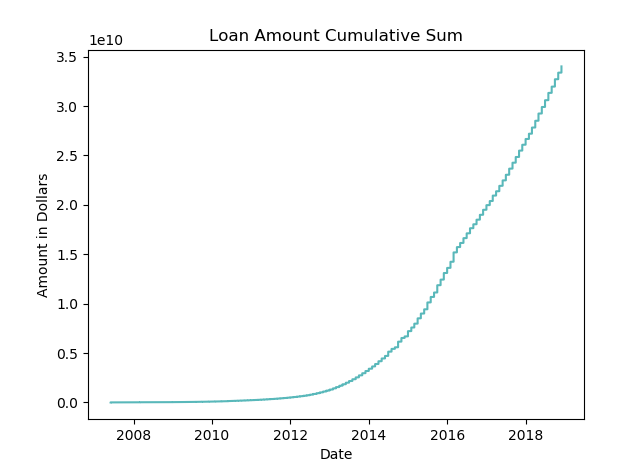

# Lending Club Loan Pipeline

## Table of Contents

1. [Purpose](https://github.com/github.com/yohn-dezmon/lending-club-loan-pipeline#purpose)
2. [Data Exploration](https://github.com/github.com/yohn-dezmon/lending-club-loan-pipeline#data-exploration)
3. [Data Processing](https://github.com/github.com/yohn-dezmon/lending-club-loan-pipeline#data-processing)
4. [Redshift Setup](https://github.com/github.com/yohn-dezmon/lending-club-loan-pipeline#redshift-setup)

## Purpose:
The purpose of this project is to (1) explore the (lending club loan dataset)[https://www.kaggle.com/wendykan/lending-club-loan-data] from kaggle to extract the important
features for data analysis and (2) to create a pipeline that would ingest, process,
and store this data on a periodic basis to be placed into storage such that it could be easily accessed by a data warehouse application, or to be used for machine learning model creation.

## Data Exploration:

### Assumptions:

One of my main assumptions was that I didn't want to throw away any data in case it was of use to analysts further down the pipeline. Thus my aim in exploration was to characterize the data and understand where there may be problematic data.

### Jupyter Notebook:

***DataExploration/loan_data_exploration.ipynb***

I chose to use a jupyter notebook to do the exploration/visualization because of its ability to visualize
the data and graphs (with matplotlib/seaborn) while you are writing the code.

To explore the dataset I observed various features. To begin I started by printing the
columns in both the data dictionary and the dataset itself, and by reading the meaning of
each of the 145 columns. From there I observed the shape of the data dictionary and
the dataset, and found that there were several columns present in the data dictionary

One of my first observations was that the id and member_id columns were null. I was initially
planning to normalize the dataset into a relational model within a relational database like
PostgreSQL, however after realizing that there was no unique id, I decided that it would
make more sense to store the entire dataset in a single table in a NoSQL/Columnar database
like Amazon Redshift.

## Main Findings:

Some of the columns had >90% null values, when placed into a database, these could be kept in a separate table
if the member_id was given. These columns can be seen in my jupyter notebook.

The majority of the columns were numerical, but there was a significant subset of textual data.
If given more time I would have considered converting this data into one-hot encoding so that
machine learning applications could easily use the categorical data for their algorithms.

## Data Visualization:

Here we can see that the cumulative sum of loans given to borrowers on the platform is increasing
exponentially with time.

## Data Processing:

**DataProcessing/loan_processor.py**

I initially planned to use Apache Spark with Java on a 3 Node EC2 cluster to complete the data processing, however I ran into issues regarding dependency management and ran out of time to troubleshoot them.
I also tried out PySpark and found it to be similar to the Java spark applications I've run in the past,
however I also ran into issues when attempting to run the PySpark application on my EC2 instance.

Thus I decided ultimately to complete the processing using pandas in Python. To see the instructions I wrote on how to set up the AWS computing cluster, please see my commits prior to the commit "updated readme to plain python".

What I was able to get done was to import the data from s3, and to do some checking to ensure that
the columns were of the right type.

### S3 to pandas:
I was able to extract the csv and data dictionary from s3 and read them into pandas dataframes
where I planned to do data validation and aggregation.
If I were to implement a autonomous pipeline I would have used Airflow to read the
data from s3 into load_processor.py every time a new file was placed into the s3 bucket.

## Redshift setup:

I setup Redshift by following the instructions found (here)[https://docs.aws.amazon.com/redshift/latest/gsg/getting-started.html].
I had to create a IAM Role specifically for redshift which is covered in step 2.
To connect to Redshift from my local computer, I had to modify the security group's
inbound rules as follows:

[**Source is left blank as it will be specific to your AWS account**]

| Type | Source | Description |
|-----------|---------|----------------|
| Redshift | <local-ip> | local-ip |
| All traffic | <spark-security-group> | self |

With more time I would included methods within my loan_processor.py module to
write one large table in Redshift. Additionally I would have done some aggregations
on the data and stored those aggregations in separate tables.

## Aggregations:

Some of the ideas I had for aggregations consist of the following:

1. How many people defaulted in a particular month?
2. Which professions have the most over-due loans?
3. Loan amount by status
4. Loan amount by co-borrower vs. single borrowers
5. Number of loans by state
